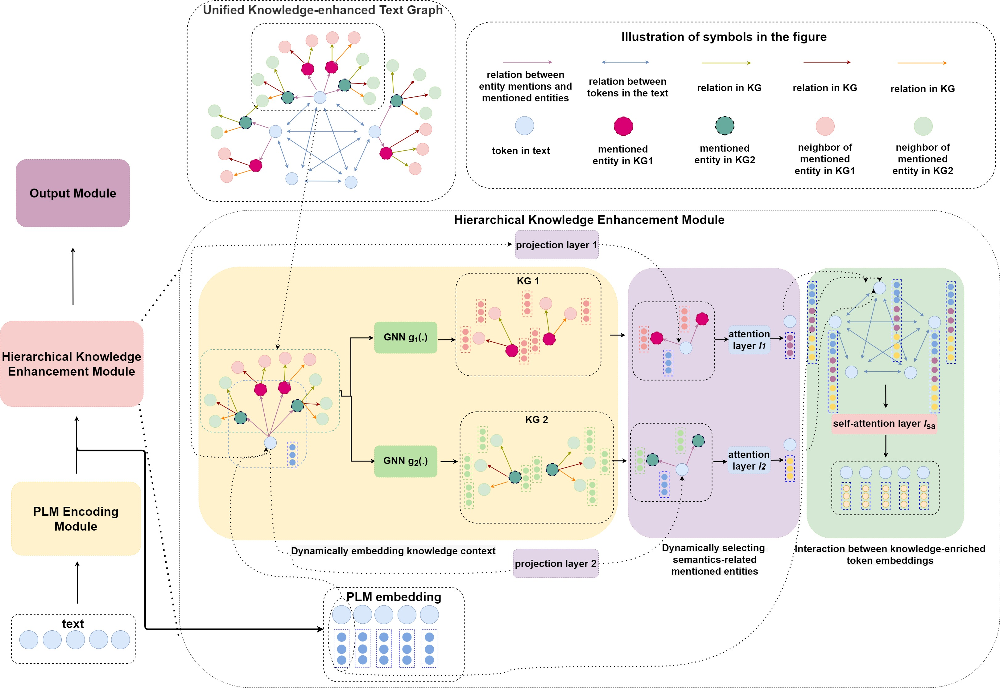

# KELM: Knowledge Enhanced Pre-Trained Language Representations with Message Passing on Hierarchical Relational Graphs

Incorporating factual knowledge into pre-trained language models (PLM) such as BERT is an emerging trend in recent NLP studies. However, most of the existing methods combine the external knowledge integration module with a modified pre-training loss and re-implement the pre-training process on the large-scale corpus. Re-pretraining these models is usually resource-consuming, and difficult to adapt to another domain with a different knowledge graph (KG). Besides, those works either cannot embed knowledge context dynamically according to textual context or struggle with the knowledge ambiguity issue. In this paper, we propose a novel knowledge-aware language model framework based on fine-tuning process, which equips PLM with a unified knowledge-enhanced text graph that contains both text and multi-relational sub-graphs extracted from KG. We design a hierarchical relational-graph-based message passing mechanism, which can allow the representations of injected KG and text to mutually updates each other and can dynamically select ambiguous mentioned entities that share the same text. Our empirical results show that our model can efficiently incorporate world knowledge from KGs into existing language models such as BERT, and achieve significant improvement on the machine reading comprehension (MRC) task compared with other knowledge-enhanced models. Our anonymous paper is available at [OpneReview](https://openreview.net/forum?id=FkG-sX5CE_).

<p align="center">
 <br />
Framework of KELM (left) and illustrates how to generate knowledge-enriched token embeddings (right)
</p>


## Environment

To install requirements:

```
pip install -r requirements.txt
```

The experiments in the paper are worked on 4 V100 GPUs. For using distributed training with multiple GPUs, please utilize Pytorch DistributedDataParallel.

## Datasets and Knowledge Graph

### 1. ReCoRD

For train and dev set, download from [**Re**Co**RD** ](https://sheng-z.github.io/ReCoRD-explorer/)

For test set, download from [SuperGlue](https://super.gluebenchmark.com/tasks)

### 2. Knowledge Graph

We uses two knowledge graphs: [WordNet](https://wordnet.princeton.edu/ ) and [NELL](http://rtw.ml.cmu.edu/rtw/)

For NELL, name entity recognition is performed by [Standford CoreNLP](https://stanfordnlp.github.io/CoreNLP/index.html). For WordNet, we find text matching from this [repository](https://github.com/villmow/datasets_knowledge_embedding)


For convenience, you can download all relative files from following google drive links:

 [link](https://drive.google.com/file/d/1J4fdA__4TOS6XQ6iN1ehDywB-qoVCoou/view?usp=sharing) unzip and replace ./data/

## Data Preprocess

download bert-large-cased model from [huggingface](https://huggingface.co/bert-large-cased) to ./cache/bert-large-cased

For train set, 

```
sh data_preprocess_train.sh
```

For dev set, 

```
sh data_preprocess_dev.sh
```

## Train

We follow the same "two-staged" training strategy with [KT-NET](https://github.com/tanvinerkar/KTNET)

Firstly, freeze language model  and run

```
sh run_first.sh
```

Then unfreeze language model and run from the saved first stage model(replace INIT_DIR with local address of saved model)

```
sh run_second.sh
```

We train 10 epochs for first stages and 4 epochs for second stages

## Evaluation

```
sh run_test.sh
```

To reproduce the paper result, you can download our best checkpoint model: [KELM<sub>BOTH</sub>](https://drive.google.com/file/d/17UiDRgpCROtTJPRsBoOdpz6h19ShXayo/view?usp=sharing) unzip and move to ./checkpoint

## Results

Our model achieves the following performance on:

ReCoRD:

| Model name               | EM/F1(Dev) | EM/F1(Test) |
| ------------------------ | ---------- | ----------- |
| BERT<sub>large</sub>     | 70.2/72.2  | 71.3/72.0   |
| SKG+BERT<sub>large</sub> | 70.9/71.6  | 72.2/72.8   |
| KT-NET<sub>WordNet</sub> | 70.6/72.8  | -           |
| KT-NET<sub>NELL</sub>    | 70.5/72.5  | -           |
| KT-NET<sub>BOTH</sub>    | 71.6/73.6  | 73.0/74.8   |
| KELM<sub>WordNet</sub>   | 75.4/75.9  | 75.9/76.5   |
| KELM<sub>NELL</sub>      | 74.8/75.3  | 75.9/76.3   |
| KELM<sub>BOTH</sub>      | 75.1/75.6  | 76.2/76.7   |

## Acknowledgement

The part of code is implemented based on the open source code of [huggingface](https://github.com/huggingface/transformers/tree/master/examples/legacy/question-answering), [DGL](https://github.com/dmlc/dgl) and [KT-NET](https://github.com/tanvinerkar/KTNET)

## License

We use Apache License 2.0.